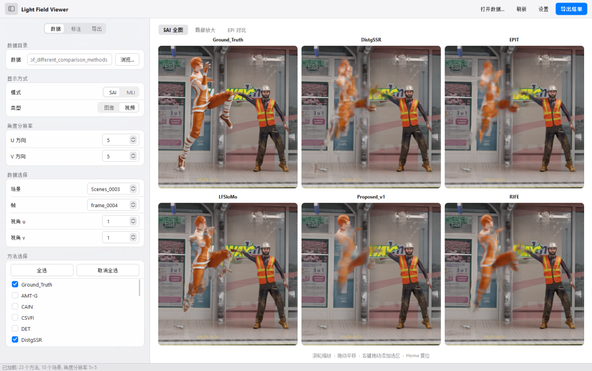
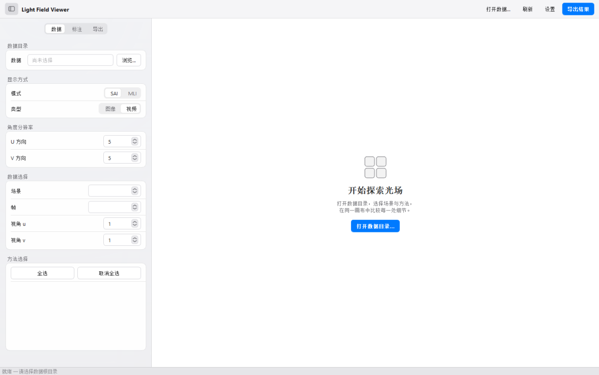
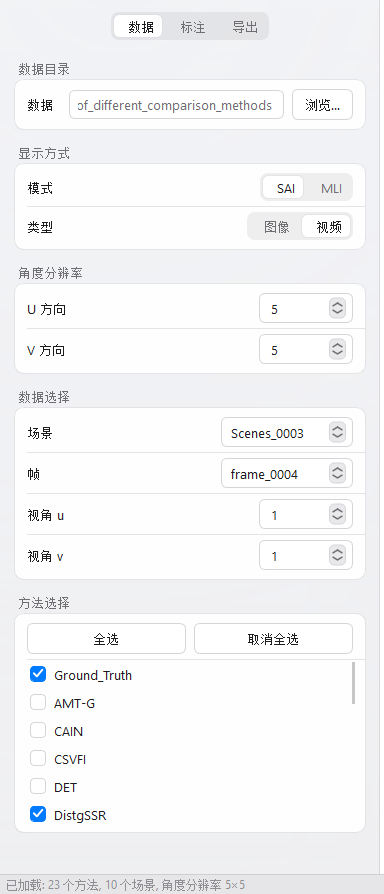
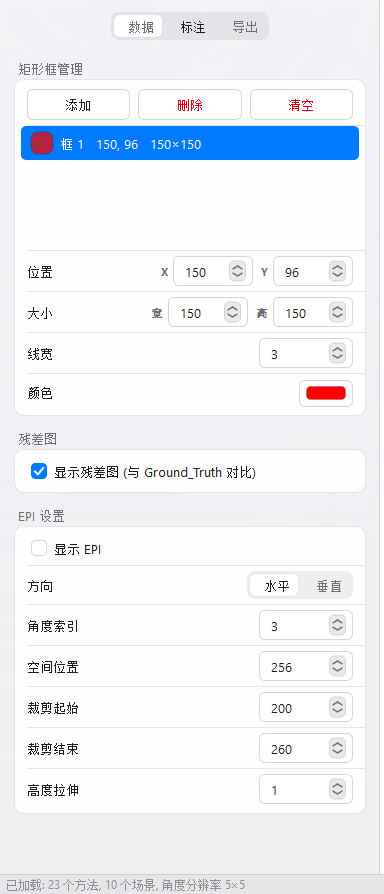
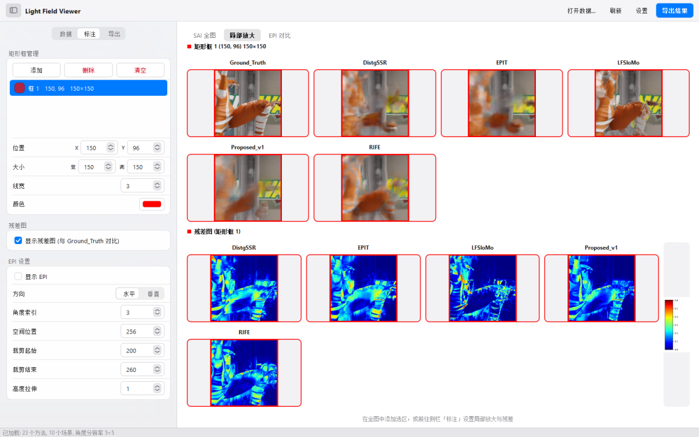
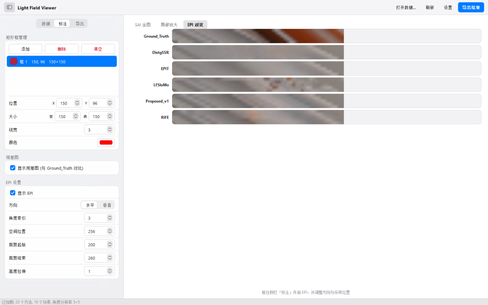
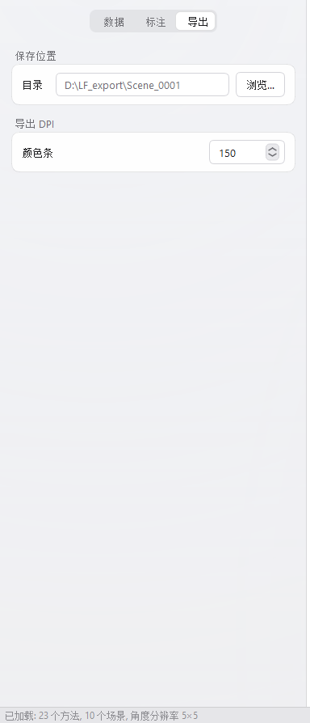
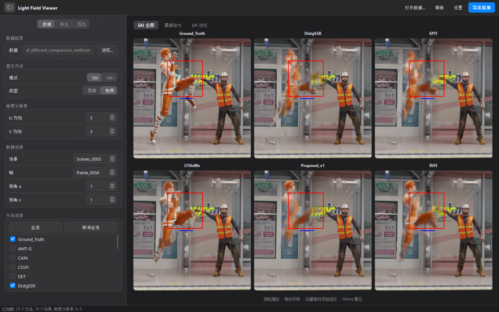

<p align="center">
  
</p>

<h1 align="center">Light Field Viewer — 光场图像查看器</h1>

<p align="center">
  <b>版本 V1.1.0</b> · 2026-09-05 · <a href="CHANGELOG.md">更新日志</a>
</p>

用于光场图像/视频的**局部放大对比**、**EPI（极平面图像）提取**和**残差分析**的桌面 GUI 工具。



## ✨ 功能概览

- 🖼️ **双可视化模式**：支持子孔径图像 (SAI) 和微透镜图像 (MLI) 两种可视化模式
- 📐 **多方法并排对比**：同时显示所有方法的重建结果，支持自适应网格排布
- 🗂️ **三个标签页**：SAI/MLI 全图 / 局部放大 / EPI 对比（EPI 仅 SAI 模式可用）
- 🔍 **SAI 全图**：滚轮同步缩放、鼠标拖拽平移、右键拖拽画框
- 🔢 **零填充文件名支持**：兼容 `1_1.png` 和 `013_013.png` 等命名方式
- 🟥 **多矩形框**：支持多个放大区域，颜色自动分配，也可用色板按钮手动指定
- 📊 **残差图**：图像归一化到 `[0, 1]` 后与 Ground_Truth 做差，jet 伪彩色显示，带全局统一颜色条
- 📈 **EPI 提取**：水平/垂直方向，指定角度索引和空间位置，裁剪范围可调
- 💾 **导出功能**：一键导出原始图、标注图、局部放大、残差图、EPI + 参数日志
- 🌓 **浅色 / 深色外观**：可跟随 Windows 系统设置自动切换，选择会被记住

## 🚀 安装与运行

### 方式一：直接双击 exe 运行（推荐）

无需安装 Python 环境，从 [Releases](https://github.com/chenzean/Light_Field_Viewer/releases) 页面下载 `LightFieldViewer.exe`，双击即可使用。

### 方式二：Python 源码运行

需要 **Python 3.7+**，以及：

```bash
pip install PyQt5 numpy Pillow matplotlib
```

```bash
python main.py
```

| 依赖 | 用途 |
|------|------|
| PyQt5 | 界面 |
| NumPy | 残差与 EPI 计算 |
| Pillow | 图像读写 |
| Matplotlib | 残差图颜色条渲染 |

### 方式三：打包为 exe

```bash
build.bat
# 生成 dist\LightFieldViewer.exe
```

当前打包脚本固定使用 `D:\Anaconda3\envs\LFVFI\python.exe`。如果本机环境路径不同，需要先修改 `build.bat` 中的 `PYTHON_EXE`。

> ⚠️ **`LightFieldViewer.spec` 目前没有纳入版本管理**（`.gitignore` 里排除了 `*.spec`），所以从仓库全新克隆后 `build.bat` 无法直接跑通，需要本机自备该 spec 文件。
> spec 中需要：显式打包 LFVFI 环境的 `libexpat.dll`、`libcrypto-3-x64.dll`、`libssl-3-x64.dll`（避免 PyInstaller 误收集其他软件目录下的同名 DLL）；`EXE()` 设置 `icon='assets/icon.ico'`；并把 `assets/` 加入 `datas`，否则 exe 里取不到应用图标。

---

# 📖 使用说明

## 🗺️ 界面总览

对照文首那张截图，窗口分四块：

| 区域 | 内容 |
|------|------|
| **顶部工具栏** | 侧栏开关、应用名、`打开数据…`、`刷新`、`设置`、`导出结果` |
| **左侧侧栏** | 三页设置：`数据` / `标注` / `导出` |
| **右侧画布** | 三个对比标签页：`SAI 全图` / `局部放大` / `EPI 对比` |
| **底部状态栏** | 加载结果、导出进度、错误提示 |

侧栏可以用工具栏最左侧的按钮或 `Ctrl+B` 收起，截图时能让对比画面占满整个窗口。

---

## 1️⃣ 打开数据

首次启动时画布是空的：



三种打开方式，效果相同：

- 画布中央的 `打开数据目录…`
- 工具栏的 `打开数据…`（`Ctrl+O`）
- 侧栏 `数据` 页 → `数据目录` → `浏览…`

选中的必须是**数据根目录**，也就是直接包含各个方法文件夹的那一层。目录结构见
[下方的「支持的数据格式」](#-支持的数据格式)。

打开后状态栏会显示扫描结果，例如 `已加载: 2 个方法, 1 个场景, 角度分辨率 5×5`。

> ⚠️ 如果方法数和场景数都是 `0`，说明选错了目录层级 —— 目前程序不会另行提示，
> 请对照[下方的「支持的数据格式」](#-支持的数据格式)重新选择。

---

## 2️⃣ 侧栏「数据」页



| 分组 | 说明 |
|------|------|
| **数据目录** | 当前数据根目录，点 `浏览…` 更换 |
| **显示方式 · 模式** | `SAI` 子孔径图像 / `MLI` 微透镜图像。切到 MLI 时角度分辨率、视角、EPI 设置会自动隐藏 |
| **显示方式 · 类型** | `图像` / `视频`。选 `图像` 时「帧」一行会隐藏 |
| **角度分辨率** | 打开数据时自动检测，也可手动改 |
| **数据选择** | 场景、帧、视角 `u` / `v` |
| **方法选择** | 勾选参与对比的方法；`全选` / `取消全选` 一键切换 |

`Ground_Truth` 会自动排在方法列表第一位。取消勾选全部方法时，画布回到空状态。

---

## 3️⃣ SAI / MLI 全图

所有勾选的方法并排显示，网格列数随窗口大小自动调整。缩放和平移在所有方法之间**同步**，
所以放大到同一处细节时可以直接横向比较。

| 操作 | 按键 / 鼠标 | 说明 |
|------|------------|------|
| 放大 | **滚轮向上** | 以鼠标位置为中心，1.25× 步进，最大 20× |
| 缩小 | **滚轮向下** | 最小回到 1× 全图 |
| 平移 | **左键拖拽** | 放大后拖动查看区域 |
| 平移 | **↑ ↓ ← →** | 键盘微调（需先点一下图像区域取得焦点） |
| 画框 | **右键拖拽** | 直接在图上拖出矩形框，自动加入侧栏列表 |
| 复位 | **双击** 或 **Home** | 回到无缩放无平移 |

画布底部一行灰字会随当前标签页提示可用操作。

---

## 4️⃣ 侧栏「标注」页



### 🟥 矩形框

- `添加` 新建一个框，或直接在全图上**右键拖拽**
- 每个框自动分配颜色（红 → 绿 → 蓝 → 黄 → 青 → 品红 → 循环）
- 在列表里选中某个框后，下方的 `位置` / `大小` / `线宽` / `颜色` 作用于该框
- `颜色` 是色板按钮，点开是系统取色器；`删除` 移除选中框，`清空` 移除全部
- SAI 和 MLI 模式都可以用矩形框做局部放大

### 📊 残差图

勾选 `显示残差图 (与 Ground_Truth 对比)` 后，「局部放大」页会在每个框下面多出一行残差图。

- 计算前先把像素除以 `255.0` 归一化到 `[0, 1]`
- 残差为 `mean(abs(method − Ground_Truth), axis=RGB)`，取值范围 `[0, 1]`
- 用 **jet 伪彩色**渲染，越暖（红）差异越大
- 颜色条**全局统一**，范围 `0 ~ global_vmax`，`global_vmax` 取参与比较的方法中的最大残差
- **需要数据中存在名为 `Ground_Truth` 的方法**，否则无法计算

### 📈 EPI 设置（仅 SAI 模式）

勾选 `显示 EPI` 启用，然后：

| 参数 | 说明 |
|------|------|
| **方向** | `水平` / `垂直` |
| **角度索引** | 用第几行/列视角提取 EPI（从 1 开始） |
| **空间位置** | 在图像的第几行（水平）或第几列（垂直）取样 |
| **裁剪起始 / 结束** | 只显示并导出这一段局部 EPI |
| **高度拉伸** | 纵向放大 EPI，便于观察线性结构（`1` = 不拉伸） |

启用后，SAI 全图上会用**蓝色短线段**标出取样位置（只画在裁剪范围内）。

---

## 5️⃣ 局部放大



每个矩形框一组，组内是所有方法的同一裁剪区域，边框颜色与该框一致，方便和全图对应。
开启残差后，每组下面再跟一行残差图，右侧是共用的颜色条。

窗口大小变化时网格会自动重排。

---

## 6️⃣ EPI 对比



所有方法的 EPI 上下排列、左端对齐，方便逐行比较线性结构的连续性。
如果这一页是空的，回到侧栏 `标注` 页确认 `显示 EPI` 已勾选。

---

## 7️⃣ 导出



1. 侧栏 `导出` 页 → `保存位置` → `浏览…` 选好目录
2. 点工具栏右上角的 `导出结果`
3. 状态栏会显示导出的图片数量和目标路径

`颜色条 DPI` 只影响残差颜色条图片的分辨率，默认 150。

> ⚠️ 如果数据里有损坏或缺失的图片文件，导出会中断且**不会**给出提示，
> 请在导出后确认目录里的文件数量是否符合预期。

### 导出目录结构（SAI 模式）

```
导出目录/
├── 00_original_sai/           # 原始无标注的 SAI 图
│   ├── Ground_Truth/
│   │   └── Ground_Truth_Scene_f0_3_3.png
│   └── ...
├── 01_rect_annotated/         # 带矩形框 + EPI 标记线的 SAI
├── 02_zoom_crop/              # 局部放大裁剪（带对应颜色边框）
├── 03_epi_full/               # 完整 EPI
├── 04_epi_crop/               # 裁剪后的局部 EPI
├── 05_residual_annotated/     # 全图残差 + 矩形框（jet 伪彩色）
│   └── colorbar.png           # 独立颜色条，范围 0 ~ global_vmax
├── 06_residual_crop/          # 局部残差裁剪（jet 伪彩色 + 边框）
└── export_log.txt             # 参数日志（记录所有设置）
```

### 导出目录结构（MLI 模式）

```
导出目录/
├── 00_original_mli/           # 原始无标注的 MLI 图
├── 01_rect_annotated_mli/     # 带矩形框的 MLI
├── 02_zoom_crop/              # 局部放大裁剪（带对应颜色边框）
├── 05_residual_annotated/     # 全图残差 + 矩形框（jet 伪彩色）
│   └── colorbar.png
├── 06_residual_crop/          # 局部残差裁剪（jet 伪彩色 + 边框）
└── export_log.txt             # 参数日志
```

文件名格式：

- SAI：`方法名_场景_f帧索引_u_v[_后缀].png`
- MLI：`方法名_场景_mli[_后缀].png`

---

## 8️⃣ 外观

`设置` → 选择 `跟随系统` / `浅色` / `深色`，选择会被记住，下次启动仍然生效。
`跟随系统` 会跟着 Windows 的浅色/深色设置自动切换。



---

## ⌨️ 快捷键

| 快捷键 | 作用 |
|--------|------|
| `Ctrl+O` | 打开数据目录 |
| `Ctrl+B` | 显示 / 隐藏左侧侧栏 |
| `F5` | 重新载入当前数据 |
| `↑ ↓ ← →` | 在 SAI / MLI 全图中平移（需先点击图像区域） |
| `Home` | 重置缩放与平移 |
| `Tab` | 在侧栏控件之间移动焦点，当前控件会显示蓝色光环 |

---

## 📁 支持的数据格式

> 💡 项目内附 `Demo数据格式/` 目录，包含以下四种格式的完整示例，可直接用软件打开验证。

### 🖼️ 子孔径图像 SAI（选择"子孔径图像 (SAI)"模式）

#### 光场图像（选择"光场图像"数据类型）

```
数据根目录/                        # 📂 对应 Demo数据格式/SAI/光场图像/
├── Ground_Truth/
│   └── Scene_001/
│       ├── 01_01.png             # {u}_{v}.png（支持零填充: 1_1 / 01_01 / 001_001）
│       ├── 01_02.png
│       ├── ...
│       └── 05_05.png             # 5×5 角度分辨率 = 25 张图
├── Method_A/
│   └── Scene_001/
│       ├── 01_01.png
│       └── ...
└── Method_B/
    └── ...
```

#### 光场视频（选择"光场视频"数据类型）

```
数据根目录/                        # 📂 对应 Demo数据格式/SAI/光场视频/
├── Ground_Truth/
│   └── Scenes_0001/              # 场景目录
│       ├── frame_0001/           # 帧目录（或 sample_000001/，名称不限）
│       │   ├── 01_01.png
│       │   └── ...               # 5×5 = 25 张 SAI
│       ├── frame_0002/
│       │   └── ...
│       └── ...
├── Method_A/
│   └── Scenes_0001/
│       └── frame_0001/
│           └── ...
└── ...
```

### 🔬 微透镜图像 MLI（选择"微透镜图像 (MLI)"模式）

#### 光场图像

```
数据根目录/                        # 📂 对应 Demo数据格式/MLI/光场图像/
├── Method_A/
│   ├── Bikes.png                 # 文件名 = 场景名
│   └── Origami.png
├── Proposed/
│   ├── Bikes.png
│   └── Origami.png
└── Ground_Truth/                 # 可选
    └── ...
```

#### 光场视频

```
数据根目录/                        # 📂 对应 Demo数据格式/MLI/光场视频/
├── Ground_Truth/
│   ├── Bikes/                    # 场景目录
│   │   ├── frame_0001.png        # 帧图像
│   │   ├── frame_0002.png
│   │   └── ...
│   └── Origami/
│       └── ...
├── Method_A/
│   ├── Bikes/
│   │   └── ...
│   └── Origami/
│       └── ...
└── ...
```

**📌 说明**：
- 不同方法的帧子目录名可以不同（如 `frame_XXXX` 和 `sample_XXXXXX`），按排序后的位置索引自动对应
- 支持 png、jpg、jpeg、bmp、tif、tiff 等常见图像格式
- 角度分辨率不限定（5×5、7×7、9×9 等均可），在左侧面板设置

### 🏷️ 文件命名兼容性

#### SAI 子孔径图像命名

以下命名方式均可正确识别，u 和 v 从 1 开始：

| 命名格式 | 示例 | 说明 |
|----------|------|------|
| `{u}_{v}.ext` | `1_1.png`, `3_5.jpg` | 基本格式，无零填充 |
| `{0u}_{0v}.ext` | `01_01.png`, `03_05.png` | 两位零填充 |
| `{00u}_{00v}.ext` | `001_001.png`, `013_013.png` | 三位零填充 |
| 任意位数零填充 | `0001_0001.png` | 均可正确解析 |

> 同一目录下的所有 SAI 文件应使用相同的命名格式。程序会自动解析数字部分，零填充不影响识别。

#### MLI 微透镜图像命名

| 命名格式 | 示例 | 说明 |
|----------|------|------|
| `{场景名}.ext` | `Bikes.png`, `Fountain.jpg` | 直接放在方法目录下，文件名为场景名 |

## 🗃️ 项目结构

```
Light_Field_Viewer/
├── main.py                     # 入口（设置应用图标与任务栏标识）
├── config.py                   # 默认参数配置
├── build.bat                   # PyInstaller 打包脚本
├── README.md                   # 本文档：功能概览 / 安装 / 使用说明 / 数据格式
├── CHANGELOG.md                # 版本更新日志
├── assets/
│   ├── icon.ico                # 应用图标（10 种尺寸，逐尺寸绘制）
│   └── icon.png                # 512px 母版
├── docs/images/                # README 使用说明里的界面截图
├── tools/
│   ├── make_icon.py            # 图标生成器（程序化绘制，无外部素材）
│   └── make_docs_shots.py      # 使用说明配图生成器
├── models/
│   ├── light_field_data.py     # 目录扫描、SAI/MLI/光场加载
│   ├── rect_annotator.py       # 矩形框绘制与裁剪
│   ├── epi_extractor.py        # EPI 提取与标记
│   └── residual.py             # 残差计算与伪彩色渲染
├── views/
│   ├── main_window.py          # 主窗口（统一工具栏 + 侧栏 + 画布）
│   ├── settings_panel.py       # 左侧设置面板（分组卡片式）
│   ├── comparison_panel.py     # 右侧三标签页对比面板
│   ├── theme.py                # 配色 token 与样式表模板（浅色 / 深色）
│   ├── controls.py             # 自绘控件（步进器、下拉、分段控件、焦点光环）
│   ├── glass_background.py     # 窗口背景
│   └── appearance.py           # 外观偏好持久化与系统主题跟随
├── controllers/
│   ├── app_controller.py       # 主控制器（SAI/MLI 双模式）
│   └── export_controller.py    # 导出控制器（含残差图导出）
├── utils/
│   ├── image_utils.py          # 图像工具（格式转换、EPI 拉伸）
│   ├── log_utils.py            # 导出参数日志
│   └── resources.py            # 资源路径解析（兼容 PyInstaller）
└── tests/
    └── test_ui_layout.py       # 界面布局与控件交互回归测试
```

## 📬 反馈与联系

如有 Bug 反馈或功能需求，请联系：

- 📧 **邮箱**：chenzean2024@126.com
- 💬 **微信**：18358481590
